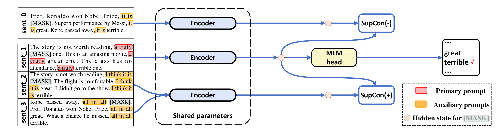

# Contrastive Learning for Prompt-based Few-shot Language Learners

This repo covers the implementation of the following paper:  **[Contrastive Learning for Prompt-based Few-shot Language Learners](https://aclanthology.org/2022.naacl-main.408/)** by [Yiren Jian](https://cs.dartmouth.edu/~yirenjian/), [Chongyang Gao](https://gcyzsl.github.io/) and [Soroush Vosoughi](https://www.cs.dartmouth.edu/~soroush/), accepted to NAACL 2022.



If you find this repo useful for your research, please consider citing the paper.

```bibtex
@inproceedings{jian-etal-2022-contrastive,
    title = "Contrastive Learning for Prompt-based Few-shot Language Learners",
    author = "Jian, Yiren  and
      Gao, Chongyang  and
      Vosoughi, Soroush",
    booktitle = "Proceedings of the 2022 Conference of the North American Chapter of the Association for Computational Linguistics: Human Language Technologies",
    month = jul,
    year = "2022",
    address = "Seattle, United States",
    publisher = "Association for Computational Linguistics",
    url = "https://aclanthology.org/2022.naacl-main.408",
    pages = "5577--5587",
    abstract = "The impressive performance of GPT-3 using natural language prompts and in-context learning has inspired work on better fine-tuning of moderately-sized models under this paradigm. Following this line of work, we present a contrastive learning framework that clusters inputs from the same class for better generality of models trained with only limited examples. Specifically, we propose a supervised contrastive framework that clusters inputs from the same class under different augmented {``}views{''} and repel the ones from different classes. We create different {``}views{''} of an example by appending it with different language prompts and contextual demonstrations. Combining a contrastive loss with the standard masked language modeling (MLM) loss in prompt-based few-shot learners, the experimental results show that our method can improve over the state-of-the-art methods in a diverse set of 15 language tasks. Our framework makes minimal assumptions on the task or the base model, and can be applied to many recent methods with little modification.",
}
```

Our code is  heavily borrowed from [LM-BFF](https://github.com/princeton-nlp/LM-BFF) and [SupCon](https://github.com/HobbitLong/SupContrast) (```/src/losses.py```).

## Requirements

This repo was tested with Ubuntu 18.04.5 LTS, Python 3.7, PyTorch 1.6.0, and CUDA 10.1. You will need a 48 GB GPU for experiments with RoBERTa-base, and 4x 48 GB GPUs for RoBERTa-large. We run our experiments on Nvidia RTX-A6000 and RTX-8000, but Nvidia A100 with 40 GB should also work.

## Download data
We use pre-processed datasets (SST-2, SST-5, MR, CR, MPQA, Subj, TREC, CoLA, MNLI, SNLI, QNLI, RTE, MRPC, QQP) from  [LM-BFF](https://github.com/princeton-nlp/LM-BFF). LM-BFF offers helpful scripts for downloading and preparing the dataset. Simply run the commands below.
```shell
cd data
bash download_dataset.sh
```
Then use the following command to generate 16-shot datasets we used in the study.
```shell
python tools/generate_k_shot_data.py
```

## Running our fine-tuning
The primary prompts (templates) used for tasks have been pre-defined in ```run_experiments.sh```. The auxiliary templates used when generating multi-views of inputs for contrastive learning can be found in ```/auto_template/$TASK```.

Assuming you have one GPU in you system, we show an example of running our fine-tuning on SST-5 (random templates and random demonstrations for "augmented views" of inputs).

```shell
for seed in 13 21 42 87 100   #### random seeds for different train-test splits
do
    for bs in 40   #### batch size
    do
        for lr in 1e-5    #### learning rate for MLM loss
        do
            for supcon_lr in 1e-5    #### learning rate for SupCon loss
            do
                TAG=exp \
                TYPE=prompt-demo \
                TASK=sst-5 \
                BS=$bs \
                LR=$lr \
                SupCon_LR=$supcon_lr \
                SEED=$seed \
                MODEL=roberta-base \
                bash run_experiment.sh
            done
        done
    done
done

rm -rf result/
```
Our framework also applies to prompt-based method without demonstrations, i.e., ```TYPE=prompt``` (In this case, we only randomly sample templates for generating "augmented views"). The results are saved in ```log```.


Using RoBERTa-large as the base model requires 4 GPUs, each with 48 GB of memory. You need to first edit Line 20 in ```src/models.py``` to be ```def __init__(self, hidden_size=1024)```.

```shell
for seed in 13 21 42 87 100   #### random seeds for different train-test splits
do
    for bs in 10   #### batch size for each GPU, total batch size is then 40
    do
        for lr in 1e-5    #### learning rate for MLM loss
        do
            for supcon_lr in 1e-5    #### learning rate for SupCon loss
            do
                TAG=exp \
                TYPE=prompt-demo \
                TASK=sst-5 \
                BS=$bs \
                LR=$lr \
                SupCon_LR=$supcon_lr \
                SEED=$seed \
                MODEL=roberta-large \
                bash run_experiment.sh
            done
        done
    done
done

rm -rf result/
```


## Collecting results
```
python tools/gather_result.py --condition "{'tag': 'exp', 'task_name': 'sst-5', 'few_shot_type': 'prompt-demo'}"
```
It will collect the results from ```log``` and compute the mean and standard deviation over those 5 train-test splits.

## Contacts
For any questions, please contact authors.


## Acknowlegements
Thanks to [LM-BFF](https://github.com/princeton-nlp/LM-BFF) and [SupCon](https://github.com/HobbitLong/SupContrast), for the preliminary implementations.
